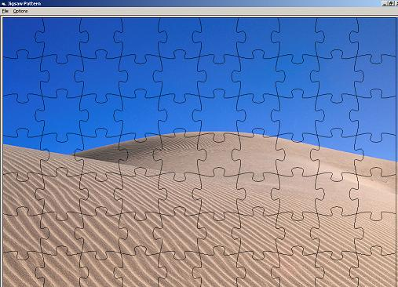



## Draw Jigsaw Pattern

### Description

I've wanted to draw jigsaw pattern for a long time. After I had seen Robert Rayment's Jigsaw Pattern project, I decided to create one.

I'd like to thank Kenny for his inspiration. Comments and suggestions are welcome. See the screenshot for what it looks like.
 
### More Info
 

             |
---                |---
**Submitted On**   |2004-04-04 01:28:28
**By**             |[Min Thant Sin](https://github.com/Planet-Source-Code/PSCIndex/blob/master/ByAuthor/min-thant-sin.md)
**Level**          |Beginner
**User Rating**    |4.7 (14 globes from 3 users)
**Compatibility**  |VB 6\.0
**Category**       |[Graphics](https://github.com/Planet-Source-Code/PSCIndex/blob/master/ByCategory/graphics__1-46.md)
**World**          |[Visual Basic](https://github.com/Planet-Source-Code/PSCIndex/blob/master/ByWorld/visual-basic.md)
**Archive File**   |[Draw\_Jigsa172830442004\.zip](https://github.com/Planet-Source-Code/min-thant-sin-draw-jigsaw-pattern__1-52854/archive/master.zip)

### API Declarations

A few API declarations.

